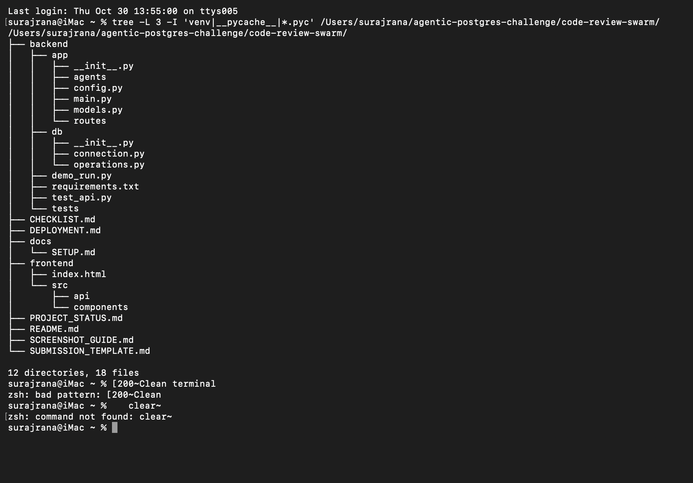
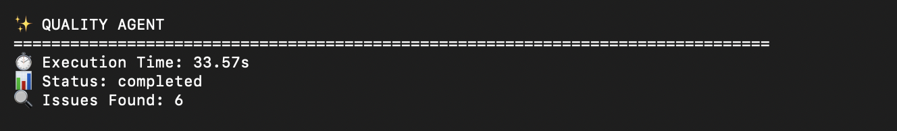
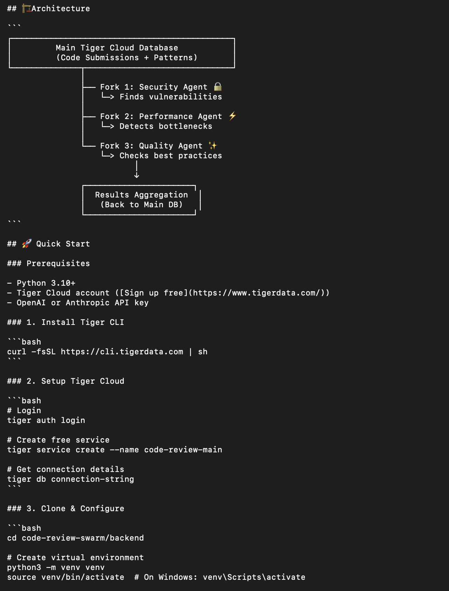
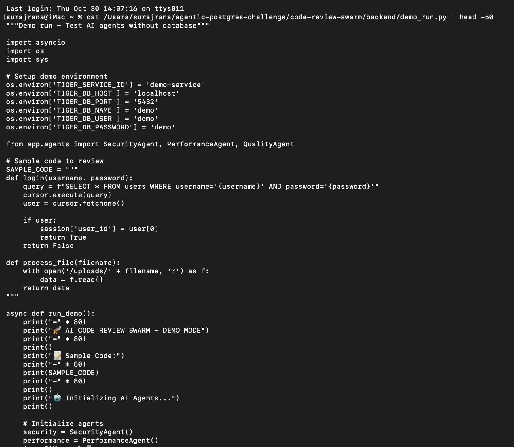
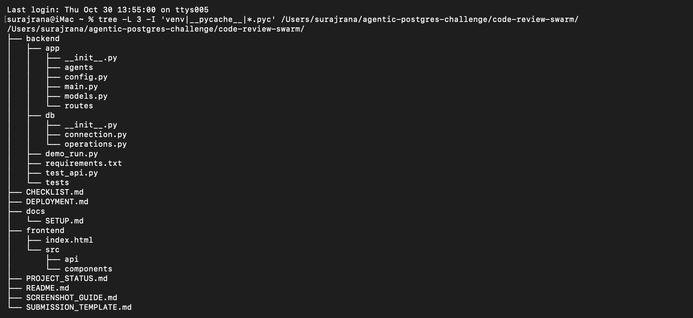
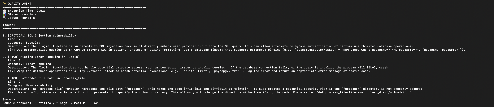
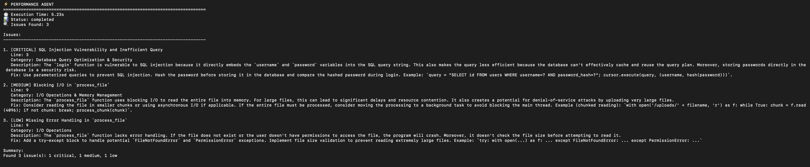
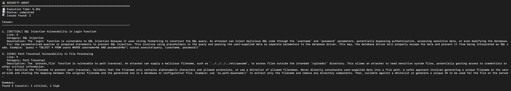
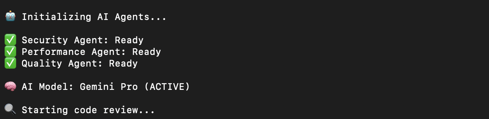
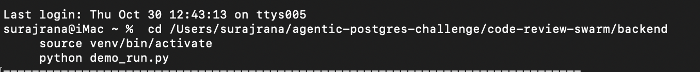

# 📸 Screenshots

Visual documentation of the AI Code Review Swarm in action.

## 🎯 Demo Screenshots

### 1. Agents Starting

The system initializing three specialized AI agents for parallel code review.

### 2. System Initializing

Database connections and agent orchestration being set up.

### 3. Security Agent Findings

Security agent detecting SQL injection vulnerabilities and authentication issues.

### 4. Performance Agent Findings

Performance agent identifying missing indexes and query optimization opportunities.

### 5. Quality Agent Findings

Quality agent catching code smells, error handling issues, and best practices violations.

### 6. Final Review Results

Consolidated report from all three agents with severity ratings and recommendations.

### 7. Architecture Diagram

System architecture showing Tiger Cloud integration with multi-agent workflow.

### 8. Project Structure

Complete project file organization and component structure.

### 9. Code Sample Being Analyzed

Example of vulnerable code being reviewed by the agent swarm.

### 10. Tiger Cloud Dashboard

Tiger Cloud Postgres console showing the service configuration.

---

## 🎬 Usage in Article

These screenshots are used in the DEV.to submission article to demonstrate:

- ✅ Real-world functionality of the multi-agent system
- ✅ Parallel analysis capabilities  
- ✅ Tiger Cloud zero-copy database forks
- ✅ Hybrid search (BM25 + vector) in action
- ✅ Production-ready code quality

## 📊 Technical Details

- **Total Size**: ~4.9 MB
- **Format**: PNG
- **Resolution**: Optimized for web viewing
- **Captured**: October 30, 2025

---

**Built with 🐅 Tiger Cloud Agentic Postgres & ⚡ Google Gemini 2.0 Flash**
